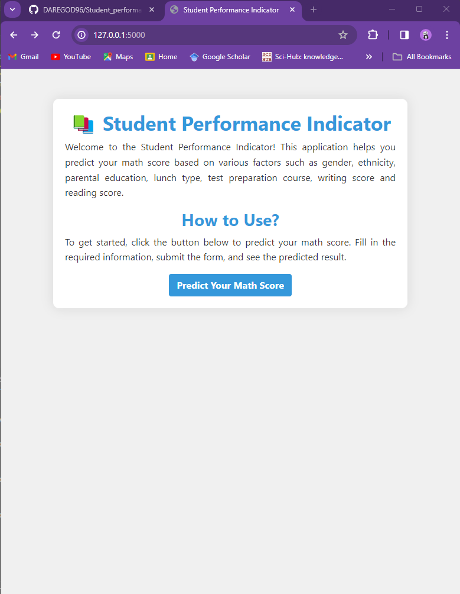
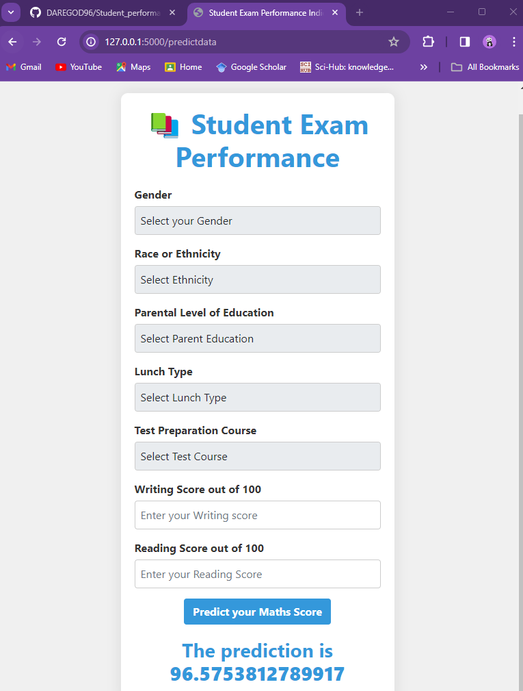

## End to End Machine Learning project

Welcome to the Student Performance Indicator! This application helps you predict your math score based on various factors such as gender, ethnicity, parental education, lunch type, test preparation course, writing score and reading score.

## Output of the following project
- A landing page with an introduction to the project and its purpose.

- An interactive form that allows users to provide the appropriate input.

